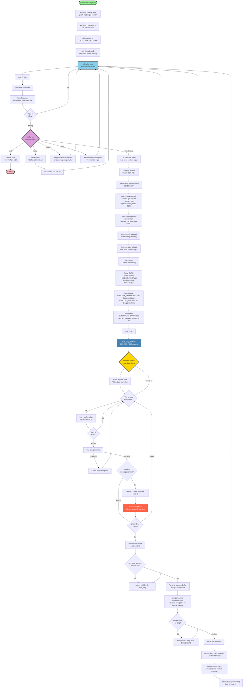

```mermaid
flowchart TD
    Start([Bắt đầu chương trình]) --> Init[Khởi tạo OllamaClient<br/>apiUrl, model: gpt-oss:20b]
    Init --> InitSession[Khởi tạo ChatSession<br/>với OllamaClient]
    InitSession --> ShowBanner[Hiển thị banner<br/>TRỢ LÝ HỌC LẬP TRÌNH]
    ShowBanner --> ShowHelp[Hiển thị hướng dẫn<br/>/help, /exit, /clear, /history]
    ShowHelp --> Loop[Vòng lặp chat<br/>while session.active]
    
    Loop --> Prompt[cout: 👤 Bạn:]
    Prompt --> GetInput[getline cin, userInput]
    GetInput --> TrimInput[Trim whitespace<br/>xóa khoảng trắng đầu/cuối]
    TrimInput --> CheckEmpty{Input có<br/>rỗng?}
    
    CheckEmpty -->|Có| Loop
    CheckEmpty -->|Không| CheckCommand{Kiểm tra<br/>lệnh đặc biệt?}
    
    CheckCommand -->|/exit| Stop[session.stop<br/>Hiển thị: Tạm biệt!]
    Stop --> End([Kết thúc])
    
    CheckCommand -->|/clear| ClearHist[history.clear<br/>Xóa lịch sử hội thoại]
    ClearHist --> ShowClearMsg[cout: ✅ Đã xóa lịch sử]
    ShowClearMsg --> Loop
    
    CheckCommand -->|/history| ShowHistory[Duyệt qua vector history<br/>for each msg: msg.display]
    ShowHistory --> Loop
    
    CheckCommand -->|/help| ShowHelpMenu[Hiển thị menu hướng dẫn<br/>Commands + tips]
    ShowHelpMenu --> Loop
    
    CheckCommand -->|Text thường| CreateUserMsg[Tạo Message object<br/>role: user, content: input]
    CreateUserMsg --> DisplayUserMsg[userMsg.display<br/>cout: 👤 Bạn: input]
    DisplayUserMsg --> BuildPayload[OllamaClient.sendMessage<br/>Bắt đầu xử lý]
    
    BuildPayload --> CreateJSON[Build JSON payload:<br/>- model: gpt-oss:20b<br/>- stream: true<br/>- options: num_predict: 4096]
    CreateJSON --> AddSystem[Thêm system prompt<br/>role: system<br/>content: Trợ lý học lập trình...]
    AddSystem --> AddHistory[Thêm lịch sử hội thoại<br/>for each msg in history]
    AddHistory --> AddUserMsg[Thêm tin nhắn hiện tại<br/>role: user, content: input]
    AddUserMsg --> DumpJSON[json.dump<br/>Chuyển thành string]
    
    DumpJSON --> SetupCURL[Setup CURL:<br/>- URL: apiUrl<br/>- Header: Content-Type: application/json<br/>- POST method]
    SetupCURL --> SetCallback[Set callback:<br/>CURLOPT_WRITEFUNCTION: StreamCallback<br/>CURLOPT_WRITEDATA: &responseBuffer]
    SetCallback --> SetTimeout[Set timeout:<br/>CURLOPT_TIMEOUT: 300s<br/>CURLOPT_CONNECTTIMEOUT: 30s]
    SetTimeout --> PrintAI[cout: 🤖 AI:]
    
    PrintAI --> PerformRequest[curl_easy_perform<br/>Gửi HTTP POST request]
    PerformRequest --> StreamLoop{StreamCallback<br/>nhận data chunk}
    
    StreamLoop --> AppendBuffer[buffer += new data<br/>Thêm data vào buffer]
    AppendBuffer --> ParseLine{Tìm newline<br/>trong buffer?}
    
    ParseLine -->|Không có| StreamLoop
    ParseLine -->|Có| ExtractLine[line = buffer.substr<br/>Tách dòng JSON]
    ExtractLine --> CheckEmpty2{line có<br/>rỗng?}
    
    CheckEmpty2 -->|Có| ParseLine
    CheckEmpty2 -->|Không| TryParse[Try: json.parse line]
    
    TryParse -->|Exception| CatchError[Catch: Bỏ qua lỗi parse]
    CatchError --> ParseLine
    
    TryParse -->|Success| CheckMessage{chunk có<br/>message.content?}
    CheckMessage -->|Không| CheckDone
    CheckMessage -->|Có| GetContent[content = chunk message content]
    GetContent --> PrintContent[cout content flush<br/>Hiển thị từng chữ real-time]
    
    PrintContent --> CheckDone{chunk done<br/>= true?}
    CheckDone -->|Không| ParseLine
    CheckDone -->|Có| FinishStream[Streaming hoàn tất<br/>cout: newline]
    
    FinishStream --> CheckCURL{curl_easy_perform<br/>thành công?}
    CheckCURL -->|Lỗi| ReturnError[return: Lỗi kết nối: error_msg]
    CheckCURL -->|OK| ParseFullResponse[Parse lại responseBuffer<br/>để lấy full response]
    
    ParseFullResponse --> BuildFullText[stringstream ss responseBuffer<br/>for each line: parse và concat content]
    BuildFullText --> CheckFullEmpty{fullResponse<br/>có rỗng?}
    
    CheckFullEmpty -->|Có| ReturnErrorMsg[return: Lỗi: Không nhận được phản hồi]
    CheckFullEmpty -->|Không| ReturnFull[return fullResponse]
    
    ReturnFull --> SaveUserMsg[history.push_back userMsg<br/>Lưu tin nhắn user]
    SaveUserMsg --> CreateAIMsg[Tạo Message object<br/>role: assistant, content: response]
    CreateAIMsg --> SaveAIMsg[history.push_back aiMsg<br/>Lưu tin nhắn AI]
    
    SaveAIMsg --> Loop
    ReturnError --> Loop
    ReturnErrorMsg --> Loop
    
    style Start fill:#90EE90,stroke:#333,stroke-width:3px
    style End fill:#FFB6C1,stroke:#333,stroke-width:3px
    style Loop fill:#87CEEB,stroke:#333,stroke-width:2px
    style StreamLoop fill:#FFD700,stroke:#333,stroke-width:2px
    style CheckCommand fill:#DDA0DD,stroke:#333,stroke-width:2px
    style PrintContent fill:#FF6347,stroke:#fff,stroke-width:2px,color:#fff
    style PerformRequest fill:#4682B4,stroke:#fff,stroke-width:2px,color:#fff

```