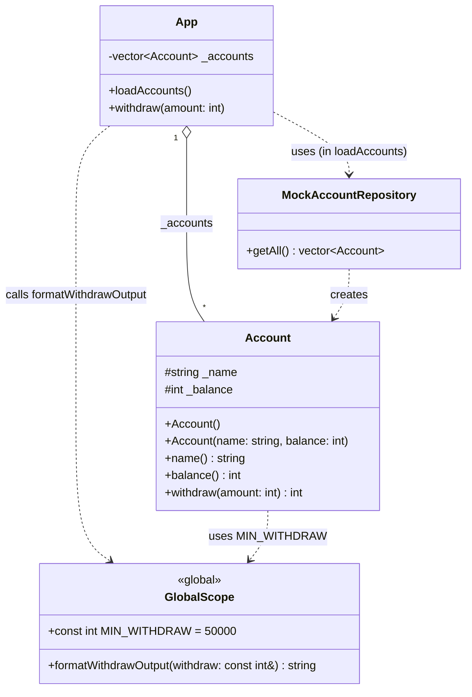

### 1. THÔNG TIN SINH VIÊN 
- Họ tên: Nguyễn Quang Phát
- MSSV: 24120117

### 2. Biên dịch chương trình 
```Bash
$ g++ -std=c++23 main.cpp -o main
```

``` Bash
$ ./main
```

### 3. TRẢ LỜI CÂU HỎI
### Câu 1:  Focus on the output above, what is missing from the given source code to achieve that output?

**Code ban đầu thiếu **2 yếu tố chính** để tạo ra được *Example Output*:**

1.  **Hàm định dạng tiền tệ (Currency Formatting Helper):**
    * **Code ban đầu:** In ra số nguyên thô (ví dụ: `100000`).
    * **Code đã sữa:** In ra chuỗi số có dấu chấm phân cách hàng nghìn (ví dụ: `100.000`).
    * **Công việc đã thực hiện:** Implement hàm `formatWithdrawOutput` để format hiển thị.

2.  **Xử lí logic về số tiền rút và số dư**
    * **Code ban đầu:** Trừ số tiền muốn rút vào số dư tài khoản.
    * **Code hiện tại:** Không trừ vào số dư tài khoản
    * **Công việc đã thực hiện:** Định nghĩa lại hàm `Account::withdraw`

---

### Câu 2. Is the function withdraw inside the class Account appropriate? What should be improved?

### 2. Is the function withdraw inside the class Account appropriate? What should be improved?

**Đánh giá: Không phù hợp.**

Hàm `withdraw` như trong code hiện tại có vấn đề lớn về mặt thiết kế so với mục đích sử dụng (chỉ in ra thông báo "can withdraw"):

1.  **Vi phạm nguyên tắc:**
    * **Vấn đề:** Hàm thực hiện hành động trừ tiền (`_balance -= amount`) ngay khi gọi. Điều này làm thay đổi dữ liệu của đối tượng `Account`.
    * **Hậu quả:** Nếu mục đích của `App` chỉ là in ra thông báo xem "có thể rút được bao nhiêu", việc gọi hàm này sẽ vô tình làm mất tiền trong tài khoản của khách hàng thật sự. Đây là lỗi **Side Effect** (tác dụng phụ không mong muốn).

2.  **Cải thiện (Refactoring):**
    * Để phù hợp, hàm này chỉ nên trả về số tiền có thể rút mà **không làm thay đổi** số dư hiện tại.
    * Cần loại bỏ dòng lệnh trừ tiền `_balance -= amount;`.

**Code cải thiện:**

```cpp
int Account::withdraw(int amount) {
    // Chỉ kiểm tra điều kiện
    if (_balance >= amount) {
        // Trả về số tiền có thể rút nhưng KHÔNG TRỪ vào _balance
        return amount;
    }
    return 0;
}
```

### 3. 

